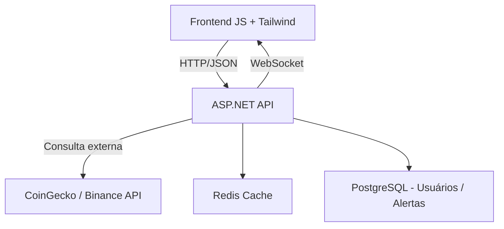

# 🪙 EncrypCoin

Monitoramento de criptomoedas com preços em tempo real, alertas personalizados e integração com CoinGecko, Binance e CryptoPanic.
Desenvolvido em **ASP.NET + PostgreSQL + Redis + Docker**, com frontend em **HTML, JS e TailwindCSS**.

---

### 🚀 Tecnologias

| Camada             | Tecnologias                               |
| ------------------ | ----------------------------------------- |
| **Frontend**       | HTML, JavaScript, TailwindCSS             |
| **Backend (API)**  | ASP.NET 8 (C#), SignalR (WebSockets), JWT |
| **Banco**          | PostgreSQL                                |
| **Cache**          | Redis                                     |
| **Infraestrutura** | Docker, Docker Compose                    |
| **APIs externas**  | CoinGecko, Binance, CryptoPanic           |

---

### 🧱 Arquitetura



---

### ⚙️ Estrutura do Projeto

```
/encrypcoin/
├── backend/               # ASP.NET API
│   ├── Controllers/
│   ├── Models/
│   ├── Services/
│   └── Dockerfile
│
├── frontend/              # HTML + JS + Tailwind
│   ├── index.html
│   ├── js/
│   ├── css/
│   └── Dockerfile
│
├── docker-compose.yml
└── README.md
```

---

### 🧠 Funcionalidades

* ✅ Preços e variações em tempo real
* 🔐 Login e autenticação JWT
* 💾 Cache inteligente com Redis
* 📊 Histórico e gráficos de moedas
* 🔔 Alertas personalizados
* 🌐 Feed de notícias de mercado

---

### 🐳 Como rodar o projeto

```bash
# 1. Clone o repositório
git clone https://github.com/seuusuario/encrypcoin.git
cd encrypcoin

# 2. Suba os containers
docker compose up --build
```

Acesse:

* Frontend → [http://localhost:8080](http://localhost:8080)
* Backend → [http://localhost:5000/api/coin](http://localhost:5000/api/coin)

---

### 📈 Próximos passos

* [ ] Adicionar painel de alertas
* [ ] Gráficos interativos com Chart.js
* [ ] WebSocket em tempo real (Binance)
* [ ] Deploy na AWS (EC2 + S3 + Route53)
* [ ] Dark/Light mode
* [ ] Testes automatizados
* [ ] Notificações via e-mail ou push
* [ ] Integração com múltiplas exchanges
* [ ] Painel de estatísticas avançadas
* [ ] Dashboard mobile-friendly
* [ ] Documentação da API pública
* [ ] Suporte a múltiplas moedas fiduciárias
